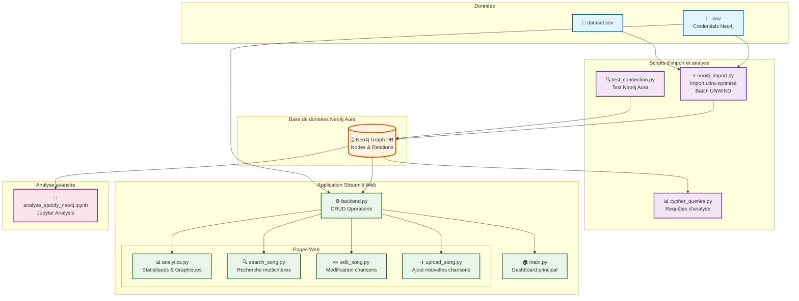
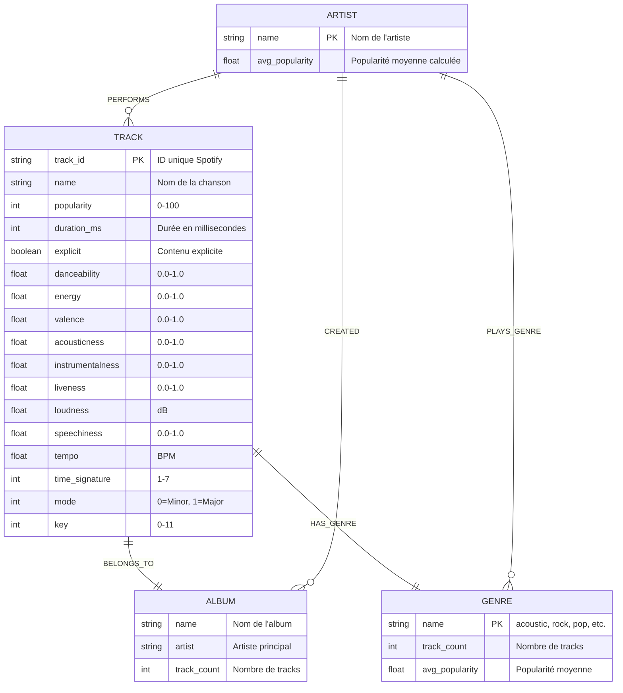
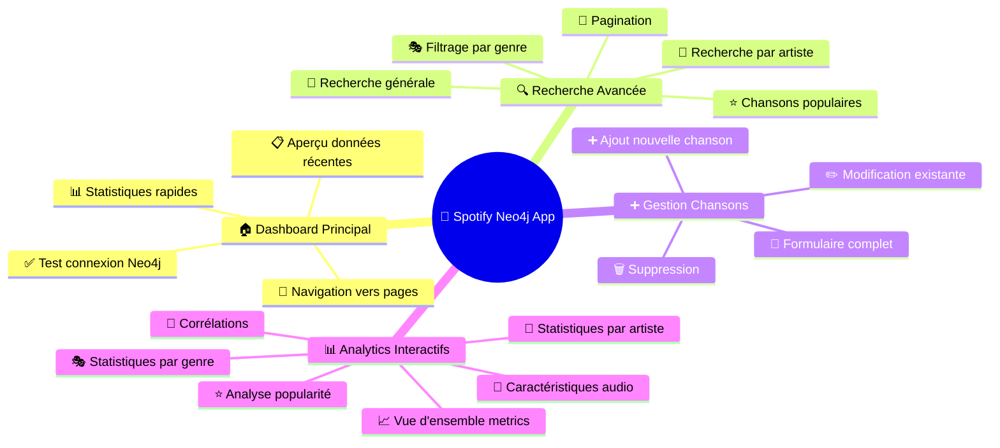
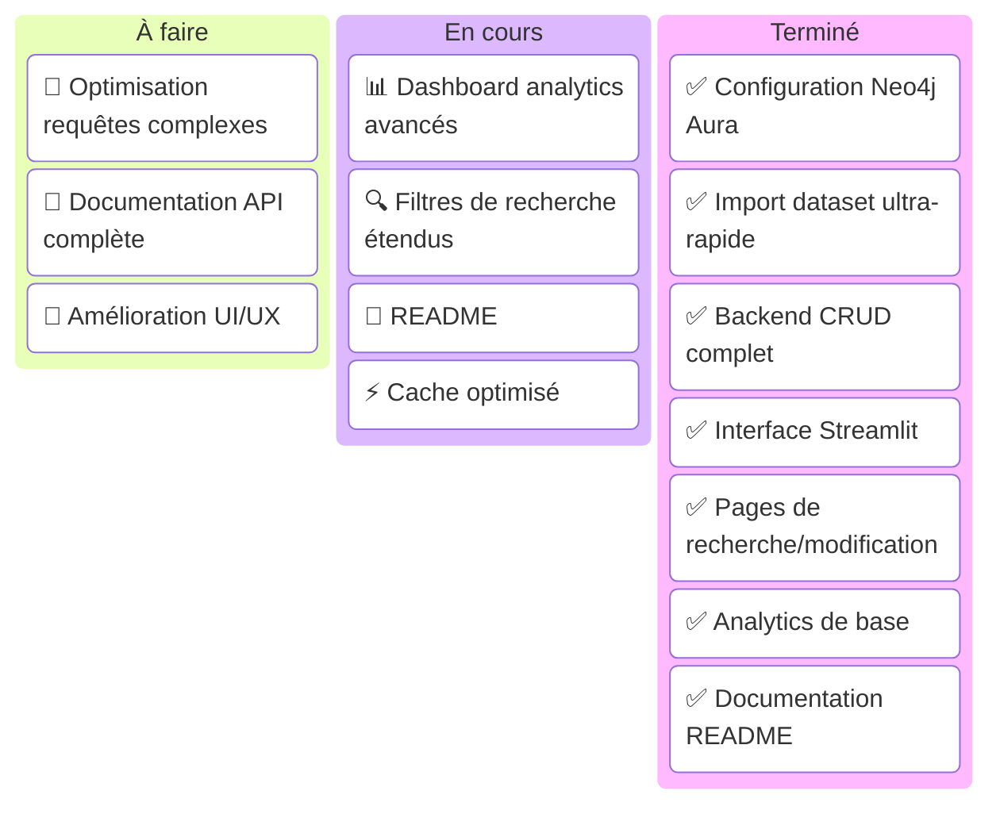
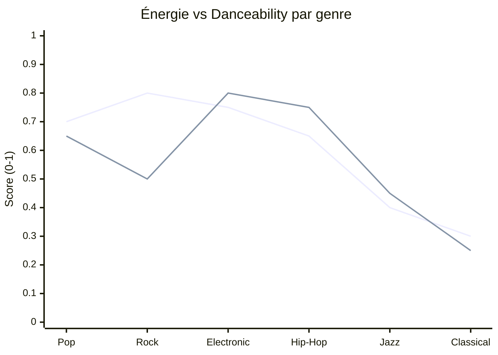
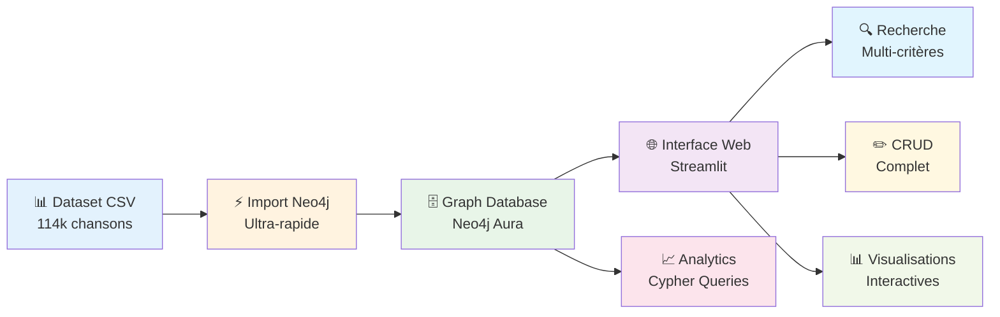

# 🎵 IPSSI Spotify NoSQL Project

Projet d'analyse de données musicales Spotify utilisant Neo4j comme base de données graphe et Streamlit pour l'interface web interactive avec fonctionnalités CRUD complètes.

## 📋 Table des matières
- [Architecture du projet](#architecture-du-projet)
- [Configuration requise](#configuration-requise)
- [Installation et configuration](#installation-et-configuration)
- [Lancement des scripts](#lancement-des-scripts)
- [Structure des données Neo4j](#structure-des-données-neo4j)
- [Fonctionnalités de l'application](#fonctionnalités-de-lapplication)
- [Analyses et requêtes](#analyses-et-requêtes)
- [Gestion de projet](#gestion-de-projet)
- [Présentation des résultats](#présentation-des-résultats)

## 🏗️ Architecture du projet



## ⚙️ Configuration requise

### Technologies utilisées
- **Python 3.8+** avec packages: `neo4j`, `pandas`, `streamlit`, `plotly`, `python-dotenv`, `numpy`, `tqdm`
- **Neo4j Aura** (base de données cloud) avec credentials dans fichier `.env`
- **Navigateur web moderne** pour l'interface Streamlit

### Dataset
- **~114,000 chansons** avec 19 caractéristiques audio (danceability, energy, valence, etc.)
- **Genres**: acoustic, afrobeat, alt-rock, ambient, etc.
- **Métadonnées**: popularité, durée, tempo, key, etc.

## 🚀 Installation et configuration

1. **Cloner le repository**
   ```powershell
   git clone https://github.com/MatisAgr/IPSSI_SPOTIFY_NOSQL.git
   cd IPSSI_SPOTIFY_NOSQL
   ```

2. **Créer environnement virtuel Python**
   ```powershell
   python -m venv venv
   .\venv\Scripts\activate
   ```

3. **Installer les dépendances**
   ```powershell
   pip install -r requirements.txt
   ```

4. **Configuration Neo4j Aura** - Créer `.env` à la racine :
   ```env
   NEO4J_URI=neo4j+s://your-instance.databases.neo4j.io
   NEO4J_USERNAME=neo4j
   NEO4J_PASSWORD=your-password-here
   NEO4J_DATABASE=neo4j
   AURA_INSTANCEID=instanceid
   AURA_INSTANCENAME=instancename
   ```

## 🛠️ Lancement des scripts

1. **Test de connexion Neo4j Aura**
   ```powershell
   cd script
   python test_connection.py
   ```
   > Vérifie la connexion et affiche les statistiques actuelles de la DB

2. **Import ultra-optimisé du dataset**
   ```powershell
   cd script
   python neo4j_import.py
   ```
   > Import par batch de 10k avec requêtes UNWIND pour performance maximale

3. **Lancer l'application web Streamlit**
   ```powershell
   cd streamlit
   streamlit run main.py
   ```
   > Interface web complète sur `http://localhost:8501`

4. **Exécuter les analyses Cypher**
   ```powershell
   cd script
   python cypher_queries.py
   ```
   > Requêtes d'analyse: top artistes, genres populaires, corrélations

5. **Analyse Jupyter (optionnel)**
   ```powershell
   jupyter notebook analyse_spotify_neo4j.ipynb
   ```

## 📊 Structure des données Neo4j

### Modèle de graphe optimisé



### Contraintes et index Neo4j

```cypher
-- Contraintes d'unicité
CREATE CONSTRAINT track_id_unique FOR (t:Track) REQUIRE t.track_id IS UNIQUE;
CREATE CONSTRAINT artist_name_unique FOR (a:Artist) REQUIRE a.name IS UNIQUE;
CREATE CONSTRAINT genre_name_unique FOR (g:Genre) REQUIRE g.name IS UNIQUE;
CREATE CONSTRAINT album_composite FOR (al:Album) REQUIRE (al.name, al.artist) IS UNIQUE;

-- Index pour les performances
CREATE INDEX track_popularity FOR (t:Track) ON (t.popularity);
```

## 🌐 Fonctionnalités de l'application Streamlit

### Interface utilisateur complète



### Fonctionnalités CRUD détaillées

#### 🏠 **Dashboard Principal** (`main.py`)
- **Connexion automatique** à Neo4j Aura avec cache
- **Statistiques rapides** en sidebar (genres, artistes)
- **Navigation intuitive** vers toutes les fonctionnalités
- **Aperçu temps réel** des chansons populaires

#### 🔍 **Recherche Multicritères** (`search_song.py`)
- **Recherche textuelle** globale (chansons, artistes, albums)
- **Filtrage par genre** avec dropdown dynamique
- **Recherche par artiste** spécifique
- **Top chansons populaires** avec limite configurable
- **Pagination** pour grandes listes
- **Statistiques contextuelles** par genre

#### ➕ **Gestion des Chansons** (`upload_song.py`)
- **Ajout complet** avec toutes les métadonnées
- **Validation des données** (popularité 0-100, tempo, etc.)
- **Parsing intelligent** des artistes multiples
- **Relations automatiques** (Album, Genre, Artiste)
- **Génération d'ID unique** si nécessaire

#### ✏️ **Modification** (`edit_song.py`)
- **Sélection depuis recherche** ou ID direct
- **Formulaire pré-rempli** avec données actuelles
- **Mise à jour sélective** des propriétés
- **Préservation des relations** complexes
- **Actions supplémentaires** (voir stats, supprimer)

#### 📊 **Analytics Avancés** (`analytics.py`)
- **Vue d'ensemble** avec métriques clés
- **Graphiques interactifs** Plotly (pie charts, histogrammes)
- **Analyses par genre** avec GROUP BY Cypher
- **Statistiques artistes** (polyvalence, popularité)
- **Corrélations audio** entre caractéristiques
- **Visualisations temps réel** des données

### Backend robuste (`backend.py`)

#### 🔧 **Opérations CRUD complètes**
- **CREATE**: `create_song()`, `create_artist()`, `create_album()`
- **READ**: `search_songs()`, `get_song_by_id()`, `get_songs_by_genre()`
- **UPDATE**: `update_song()`, `update_artist()` 
- **DELETE**: `delete_song()`, `delete_artist()`

#### 📊 **Analytics intégrés**
- `get_genre_statistics()` - Statistiques par genre
- `get_artist_statistics()` - Analyses par artiste  
- `get_popular_songs()` - Top chansons
- Gestion automatique des **relations complexes**

## Analyses et requêtes Cypher

### Exemples de requêtes Cypher utilisées

#### 1. **Top 10 Artistes les plus populaires**
```cypher
MATCH (a:Artist)-[:PERFORMS]->(t:Track)
RETURN a.name as artist, 
       COUNT(t) as nb_tracks, 
       AVG(t.popularity) as avg_popularity,
       MAX(t.popularity) as max_popularity
ORDER BY avg_popularity DESC
LIMIT 10
```

#### 2. **Analyse des genres musicaux**
```cypher
MATCH (g:Genre)<-[:HAS_GENRE]-(t:Track)
RETURN g.name as genre, 
       COUNT(t) as nb_tracks, 
       AVG(t.popularity) as avg_popularity,
       AVG(t.energy) as avg_energy,
       AVG(t.danceability) as avg_danceability
ORDER BY avg_popularity DESC
```

#### 3. **Albums avec le plus de tracks**
```cypher
MATCH (al:Album)<-[:BELONGS_TO]-(t:Track)
RETURN al.name as album, 
       al.artist as main_artist,
       COUNT(t) as nb_tracks,
       AVG(t.popularity) as avg_popularity
ORDER BY nb_tracks DESC
LIMIT 20
```

#### 4. **Artistes polyvalents (multi-genres)**
```cypher
MATCH (a:Artist)-[:PLAYS_GENRE]->(g:Genre)
RETURN a.name as artist,
       COLLECT(DISTINCT g.name) as genres,
       SIZE(COLLECT(DISTINCT g.name)) as nb_genres
ORDER BY nb_genres DESC
LIMIT 15
```

### Performance et optimisation

- **Import ultra-rapide** : Batch UNWIND de 10k lignes
- **Contraintes d'unicité** pour éviter les doublons
- **Index sur popularité** pour les recherches fréquentes
- **Relations optimisées** pour navigation rapide dans le graphe
- **Cache Streamlit** pour performances web

## 📋 Gestion de projet

### Lien Trello - Suivi des tâches

**Tableau Trello - IPSSI Spotify NoSQL**



### Répartition des tâches équipe

| 👤 Membre | 🎯 Responsabilités |
|-----------|-------------------|
| **Matis** | Configuration Neo4j Aura, Scripts d'import optimisés |
| **Julien** | Interface Streamlit, Pages CRUD, UI/UX, Documentation |
| **Carl** | Backend, Requêtes Cypher, Analytics, Notebook Jupyter |

## 🎯 Présentation des résultats


#### 📊 Statistiques du dataset analysé


#### 🎵 Caractéristiques audio moyennes par genre



#### 🏆 Indicateurs de performance technique

| 🔧 Métrique | 📈 Valeur | 💡 Description |
|-------------|-----------|----------------|
| **Chansons importées** | ~114,000 | Dataset Spotify complet |
| **Performance import** | 2,500 lignes/sec | Import ultra-optimisé UNWIND |
| **Nœuds Neo4j** | ~180,000 | Tracks + Artists + Albums + Genres |
| **Relations créées** | ~350,000 | PERFORMS, BELONGS_TO, HAS_GENRE, etc. |
| **Pages Streamlit** | 5 | Dashboard, Search, CRUD, Analytics |
| **Requêtes Cypher** | 15+ | Analyses statistiques avancées |

### Architecture technique validée



### Fonctionnalités démontrées

✅ **Import massif performant** avec contraintes et index  
✅ **Interface CRUD complète** pour gestion des données  
✅ **Recherche multicritères** avancée  
✅ **Analytics temps réel** avec visualisations  
✅ **Relations graphe complexes** optimisées  
✅ **Architecture scalable** Neo4j + Streamlit  

### Technologies validées

- **Neo4j Aura** : Base de données graphe cloud haute performance
- **Python Streamlit** : Interface web interactive rapide  
- **Requêtes Cypher** : Analyse de graphe native et puissante
- **Plotly** : Visualisations interactives professionnelles
- **Architecture modulaire** : Séparation backend/frontend claire

---

## 📝 Notes techniques importantes

⚠️ **Prérequis essentiels :**
- Connexion Neo4j Aura configurée dans `.env`
- Python 3.8+ avec packages requirements.txt
- Dataset CSV disponible dans `/data/dataset.csv`

🔧 **Configuration recommandée :**
- L'application Streamlit sera accessible sur `http://localhost:8501`
- L'import peut prendre 3-5 minutes selon la connexion
- Cache Streamlit activé pour performances optimales

🚀 **Déploiement possible sur :**
- Streamlit Cloud (gratuit)
- Heroku avec Neo4j Aura
- Docker containerisé

---

*📚 Projet réalisé dans le cadre du cours NoSQL - IPSSI 2025  
🎯 Démonstration d'architecture Neo4j + Streamlit pour analytics musicaux*